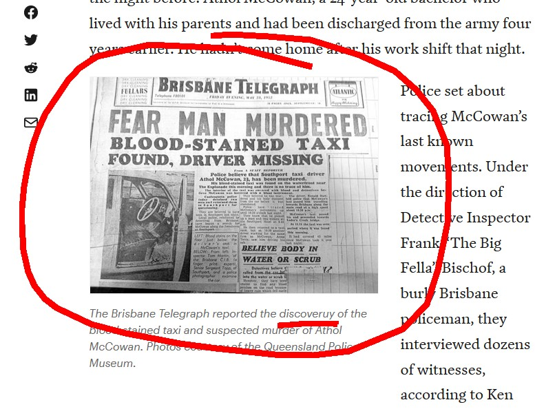
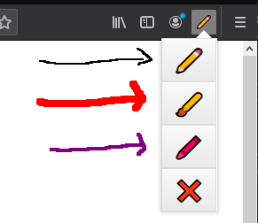

## Screenshots

## About
Create a canvas element in your active tab. Draw on that with 3 exciting colors!

## Link
[easy draw](https://github.com/kosmos434/draw-extension)

#### Todo
* work on all websites?
* choose color/brush
* Submit to [addons.mozilla.org](https://addons.mozilla.org/en-US/firefox/)
* Submit to chrome

###### ✏️